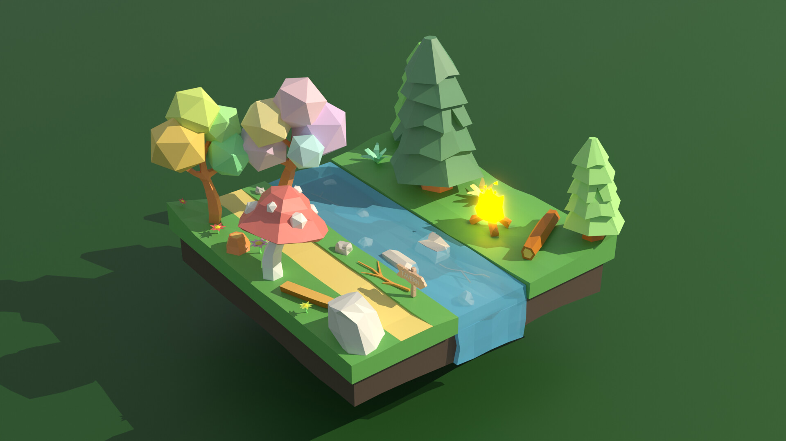

# La partie visuelle du projet

## Concept général
### Thème
- Univers 3D qui utilise les projecteurs pour immerser l'intéracteur, celui-ci pouvant modifer cet univers en utilisant des objets de détection.
### Espace
- Idéalement, le petit studio, puisque c'est relativement petit comme pièce.

###### Source: ME

## Inspirations
### Concept
- N/A, brainstorm avec l'équipe
### Artistique
- Style low poly, garde le visuel clair et simple à comprendre et créer.

###### Source: https://blenderartists.org/t/low-poly-world-path-in-the-magical-forest/1406021/

###### Source: https://www.reddit.com/r/lowpoly/comments/gvpi3q/low_poly_night_scene_in_the_woods_a_rework_of_the/

###### Source: https://www.pinterest.ca/pin/800022321292340025/

### Technique
- Reactable (de Cob)

## Concept spécifique
Avec 3 projecteurs autour de nous, on peut récréer un environement immersif pour l'utilisateur. Je compte utiliser cet environement pour enrichir l'aspect interactif de l'utilisateur en leur donnant le pouvoir de changer ceci avec des objets de détection, un *peu* comme des pouvoirs de dieu (?). Par example, poser une statuette d'une lune va causer le changement du temps de la journée à la nuit, une statuette d'un flocon de neige va apporter de la neige, etc.

###### Source: https://blenderartists.org/t/low-poly-world-path-in-the-magical-forest/1406021/

## Défis/limites
Evidemment, une grande limitation pour ce projet sera le fait qu'il ne fonctionnerais plus ou moins à l'extérieur si il y a du soleil, puisque celui-ci cacherais l'image du projecteur + le fait qu'il n'est pas recommendé d'apporter des projecteurs à l'extérieur.
