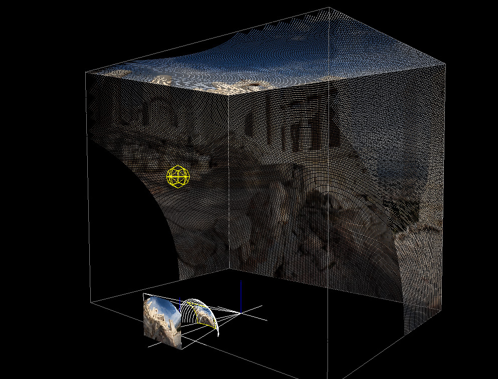
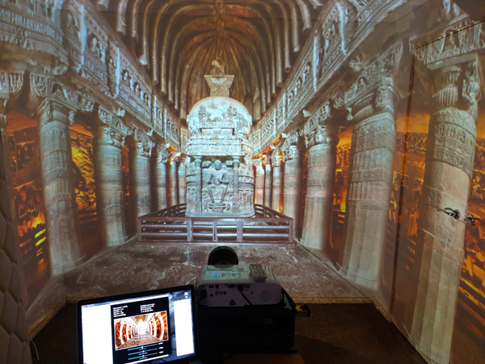
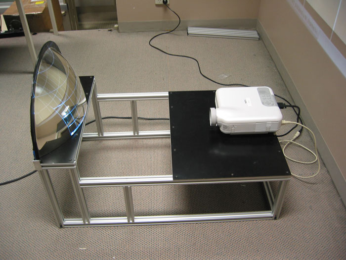
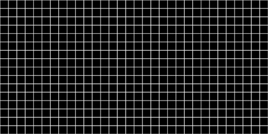
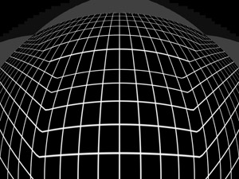
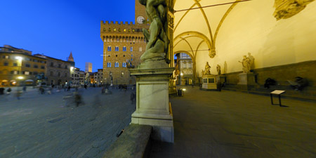
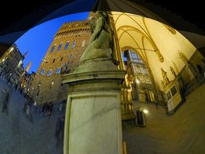

# projecteurs + miroir sphérique
Lorsqu'on combine un projector avec un miroir sphérique, il est possible d'avoir un effet intéressant dans la pièce au complet.

##### Simulation d'une projection
###### Source: Paul Bourke, https://paulbourke.net/dome/mirrorbox/
Évidemment, cette méthode n'est pas parfaite pour créer une projection dans la salle au complet mais c'est parmis ceux que j'ai trouver les plus intéressantes et les moins chers.

##### Salle illuminé par cette méthode.
###### Source: Paul Bourke, https://paulbourke.net/dome/mirrorbox/

## R&D
Pour avoir un effet comme dans cette image, il y a deux éléments importants qu'il faut avoir en premier.

1. L'installation
L'installation est relativement simple, puisque c'est un miroir courbé et un projecteur.

##### Projecteur et miroir.
###### Source: Paul Bourke, https://paulbourke.net/dome/mirrorbox/

2. L'image
L'image est la partie plus difficile, puisqu'il y a des manipulations complexes à faire.

##### Image de base d'exemple.
###### Source: Paul Bourke, https://paulbourke.net/dome/mirrorbox/

##### Image de base d'exemple avec la déformation.
###### Source: Paul Bourke, https://paulbourke.net/dome/mirrorbox/

##### Image d'exemple avec un lieu.
###### Source: Paul Bourke, https://paulbourke.net/dome/mirrorbox/

##### Image d'exemple d'un lieu avec la déformation.
###### Source: Paul Bourke, https://paulbourke.net/dome/mirrorbox/

# application de cette méthode
Avec cette installation, il est possible d'illuminer et utiliser l'entiereté de la surface, notamment la salle d'enregistrement dans le petit studio et le cyclorama au complet pour montrer quelque chose, que ce soit une vidéo ou des images. Notamment, il est possible de changer l'environnement dans lequel se trouve actuellement l'utilisateur, par exemple, l'utilisateur se retrouve dans une forêt et après avoir fait quelque chose, il se retrouve dans le désert.
