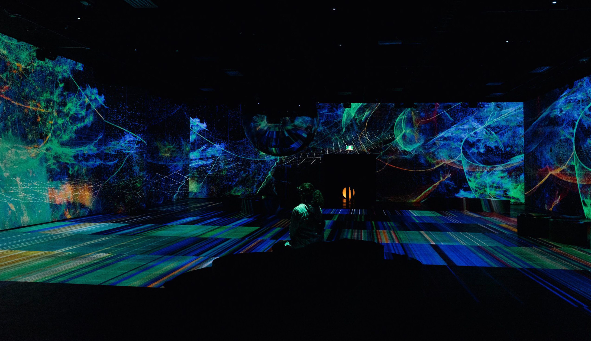

# Environnements immersifs (sans VR)
Lorsqu'on combine des projecteurs, des lumières et des hauts-parleurs (et possiblement autres installations), il est possible d'avoir un environnement réaliste qui immerse l'utilisateur.

##### Oasis Immersion, Vitamine Immersive
###### Source: Oasis Immersion, https://oasis.im/en/vitamine-immersive/

## R&D

##### fish fish fish fish fish fish fish fish
###### Source: teamLab, https://www.teamlab.art/w/koi_and_people/#modal-1

##### Sweet Folie
###### Source: Oasis Immersion, https://oasis.im/en/sweet-folie/

##### Charivari
###### Source: Oasis Immersion, https://oasis.im/en/sweet-folie/

##### Bingo Bango
###### Source: Oasis Immersion, https://oasis.im/en/sweet-folie/

##### TETRIS LSD
###### Source: TETRIS EFFECT!!!!!!!!!!!!!!

# application de cette théorie
Selon moi, un des endroits idéals pour une installation immersive de même est le cyclorama dans le grand studio puisque c'est une grande "pièce" blanche. Ce qu'on a imaginé est de donner à l'utilisateur l'option de changer cet environnement comme il le souhaite (changer le ciel, le fond, le plancher, etc), contrairement aux examples montrés en haut, qui sont "statiques".
